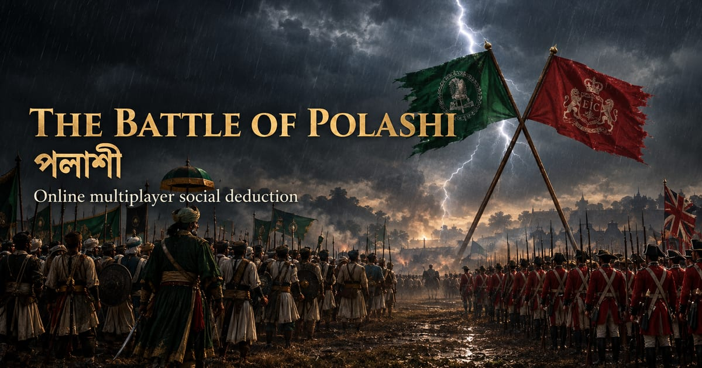

# The Battle of Polashi (পলাশী)

A real-time multiplayer web adaptation of *Polashi*, a social deduction board game published by
Playground Inc. (Bangladesh). This is an unofficial, fan-made project: I did not design the game,
I built the online version of it.

Live: https://the-great-polashi-game.vercel.app



## How it started

My friends, colleagues and I got hooked on *Polashi*. We started with the physical board game and
were soon spending hours on it. Two things kept getting in the way: someone
always had to bring the box, and we could only play when we were all in the same room.

So we asked what it would take to move the game online: no box to carry, and everyone could join
over the internet from wherever they were. I started building it, and it grew one piece at a time
into what's here now: one person opens a room, and everyone plays from their own phone or laptop.

It began as a way for our group to keep playing. If you enjoy it, [buy the board game](https://www.rokomari.com/product/293046/polashi-a-social-deduction-board-game-5-to-10-players-age-12plus) too.

## Features

- **Rooms and lobby.** One player opens a room and becomes its game master. Others join with the
  room code or an invite link (`/?room=CODE`). The game master can lock the room, remove players,
  choose which characters are in play and toggle secret intelligence. Supports 5 to 10 players.
- **Hidden roles.** Each player is dealt a character on the Nawab or East India Company side. The
  server sends every client its own view of the room, so a player's browser only receives their own
  character and the intel that character is allowed to see.
- **Server-authoritative game state.** Clients send intents (propose a team, cast a vote, investigate)
  and render whatever room state the server broadcasts. The server checks who is allowed to act,
  counts votes and decides round results.
- **Round flow.** A General proposes a battalion, the council approves or rejects it in an open vote,
  then the battalion votes success or sabotage in secret. Team sizes and sabotage thresholds per
  round are in [src/constants.ts](src/constants.ts).
- **Guptochor.** From round 3, one player may secretly check another player's side. That player holds
  the Guptochor next.
- **Mir Jafor endgame.** If the Nawabs win three rounds, Mir Jafor gets one guess at who Mir Madan is.
  A correct guess hands the win to the East India Company.
- **Reconnects.** Room code, player id and the seat's secret rejoin token are kept in `localStorage`,
  so a refreshed or dropped client rejoins its seat. Only the token's owner can reclaim a seat.
- **Device key.** A random id made once per browser (`getPlayerKey` in
  [src/services/sessionStore.ts](src/services/sessionStore.ts)) and sent on `createRoom` and
  `joinRoom`, so the server's game logs can group one device's games. It survives leaving a room,
  isn't a secret, and proves nothing about who someone is.
- **PWA.** Installable, with a service worker (vite-plugin-pwa) that caches the app shell. Playing still
  needs a connection to the game server.
- **SEO.** Per-route title, description, Open Graph tags and JSON-LD; a pre-rendered `/how-to-play`
  page; sitemap generated at build time.

## Tech stack

- React 19, TypeScript, Vite 7, React Router
- socket.io-client for real-time sync
- vite-plugin-pwa
- Vitest and React Testing Library
- sharp for the image pipeline
- Vercel hosting and Vercel Analytics

## Architecture

```
browser (this repo)  <-- socket.io -->  game server (polashi_game_backend)
  React UI renders the room                Express + socket.io
  state it receives                        rooms held in memory
                                           game logs written to Postgres (Supabase)
```

The backend lives in a separate repository:
https://github.com/iammahir2020/polashi_game_backend

- [src/services/socket.ts](src/services/socket.ts) wraps every socket event the client sends or
  listens for. The server URL comes from `VITE_SOCKET_URL`, falling back to the production server.
- [src/services/payloads.ts](src/services/payloads.ts) checks every payload the server sends before
  React renders it.
- [src/components/GameDashboard/index.tsx](src/components/GameDashboard/index.tsx) holds the client
  state and switches between the lobby, the board and the overlays.
- [src/seo/](src/seo/) holds the metadata for each public route.

## Security

The game server is the authority: it identifies each player by their socket, checks every action
(host-only actions, the General's team, the Mir Jafor strike), and sends each player only what they
may see. [SECURITY_AUDIT.md](SECURITY_AUDIT.md) lists every finding and how it was fixed. On the
client side:

- Every server payload is cleaned before rendering ([src/services/payloads.ts](src/services/payloads.ts)),
  and an error boundary shows a recovery screen instead of a blank page.
- Names and room codes are cleaned while typing ([src/lib/names.ts](src/lib/names.ts)); the server
  applies the same rules.
- [vercel.json](vercel.json) sets a Content-Security-Policy, clickjacking protection and other
  security headers. `vite preview` applies the same headers, so the e2e tests run under the
  production policy. **If the game server moves, update `connect-src` in `vercel.json` along with
  `VITE_SOCKET_URL`.**

## Local setup

Requires Node 20.19 or newer (Vite 7).

```sh
npm install
npm run dev
```

Optional environment variables (put them in `.env.local`):

| Name | Purpose |
|---|---|
| `VITE_SITE_URL` | Canonical site URL used in meta tags, JSON-LD and the sitemap |
| `VITE_SITE_SAME_AS` | Comma-separated profile URLs for JSON-LD `sameAs` |
| `VITE_GOOGLE_SITE_VERIFICATION` | Google Search Console token; adds the verification meta tag to the build |
| `VITE_SOCKET_URL` | Game server URL (default: the production server on Render) |

To play against a local backend, run polashi_game_backend (`npm start`, port 3000) and set
`VITE_SOCKET_URL=http://localhost:3000/`.

## Scripts

| Script | What it does |
|---|---|
| `npm run dev` | Vite dev server |
| `npm run build` | Generates sitemap and robots.txt, type-checks, builds, then pre-renders `/how-to-play` |
| `npm run preview` | Serves the production build |
| `npm test` | Runs the Vitest suite once |
| `npm run test:watch` | Vitest in watch mode |
| `npm run e2e` | All Playwright end-to-end tests (some need a local backend on :3000) |
| `npm run e2e:build` | Only the end-to-end tests that run against the production build, no backend needed |
| `npm run typecheck` | `tsc -b --noEmit` |
| `npm run lint` | ESLint |
| `npm run art -- --vector` | Redraws the original vector art in `art-src/` from code (the live art is hand-supplied) |
| `npm run assets` | Rebuilds the images in `public/` from `art-src/` (see [art-src/README.md](art-src/README.md)) |

## Testing

Unit and component tests sit next to their source as `*.test.ts(x)` and run in jsdom (pure logic in
node). They cover the game constants and vote logic, the main components, the server payload checks,
name rules, the rejoin storage, the error boundary, the SEO metadata and JSON-LD, and a check that
the static tags in `index.html` match `src/seo/seoConfig.ts`.

```sh
npm test
```

End-to-end tests in `e2e/` use Playwright, in two suites. The multiplayer specs (`app`,
`create-room`, `reconnect`, `capstone`, `seo`) run against `npm run dev` with `VITE_SOCKET_URL`
pointed at a local backend on port 3000; see [TESTING.md](TESTING.md). The build specs
(`landing`, `static`) run against the production build (`vite preview` on port 4317, started
automatically) and stub the socket.io connection, so they never reach the game server. The build specs cover the intro splash, the enlistment form, the credit footer, head tags and JSON-LD,
noindex on room links, the pre-rendered how-to-play page with JavaScript off, the sitemap, robots.txt,
the manifest and every image the app references, the security headers, and that no page triggers a
CSP violation. Each build spec runs on a desktop and a mobile viewport.

```sh
npx playwright install chromium   # once
npm run e2e:build                 # no backend needed
npm run e2e                       # everything, with the backend running
```

## Deploying

This frontend and the game server can be deployed in either order. An older server ignores the
device key, and the current one drops a malformed key rather than refusing the player. Since the
rejoin-token change, a player on a tab older than that who reloads mid-game is asked to join
again.

## Privacy

No accounts, no sign-in, no cookies. The browser stores the room code, player id and rejoin token
for the current seat and deletes them on leaving. It also keeps a random device key, which stays
after leaving so one device's games can be grouped. The server logs each game for statistics in
a Postgres database: room code, device key, aliases, roles and sides, every proposed team with each
player's approval vote, each mission's votes and result, Guptochor checks, connection drops, and
how the game ended. Records and aliases are kept with no set end date. Page views are counted by
Vercel Web Analytics, which is cookieless. The same summary is on the How to play page.
Questions or removal requests: mahiralkamal.mak@gmail.com.

## Credits & disclaimer

Digital version © 2026 Mahir Al Kamal. All rights reserved. This covers the code, design and
original artwork of this online version, not the game: *Polashi*, its rules and its name belong to
Playground Inc. Contact: mahiralkamal.mak@gmail.com.

Unofficial fan-made digital adaptation of *Polashi* by Playground Inc. Not affiliated with or
endorsed by Playground Inc. No Playground Inc. artwork, logos or rulebook text are used.
[Get the physical game](https://www.rokomari.com/product/293046/polashi-a-social-deduction-board-game-5-to-10-players-age-12plus).

The game mechanics derive from *The Resistance: Avalon* by Don Eskridge.

Fonts in `scripts/fonts/` (Cinzel, EB Garamond, Noto Serif Bengali) are used under the SIL Open
Font License; the license files are alongside them.
